<picture>
  <source media="(prefers-color-scheme: dark)" srcset="./assets/banner-dark.svg">
  <source media="(prefers-color-scheme: light)" srcset="./assets/banner-light.svg">
  
</picture>

  
  
  
  

I build and run backend systems where money moves. For 6 years I've worked on production Rails platforms for US companies. Today that's payments and subscriptions at **[TuneCore](https://www.tunecore.com/)**, a music distribution platform that has paid independent artists more than **$5B**. Before that it was **Lucet**, a behavioural health platform covering **15M lives**, where I raised test coverage by 40%.

- 💳 **Payments:** multi-gateway billing across Adyen, PayPal, Braintree and PayU, plus renewals, webhooks and Avalara real-time tax
- 🧱 **Backend:** reliable APIs, background jobs, and keeping large legacy Rails codebases healthy
- 🤖 **AI tooling:** guardrails for coding agents and LLM pipelines, such as test-weakening detection and PII redaction

### 📦 Open source

**14,000+ downloads across my Ruby gems.** The counts below update live.

| Project | What it does |
|:--|:--|
| <a href="https://github.com/TheSoloHacker47/scrubber-rb"><b>scrubber_rb</b></a>  | Fast PII and secret redaction for Ruby, with a Rust core. Scrub logs, prompts and payloads before they leak |
| <a href="https://github.com/TheSoloHacker47/bundler-overrule"><b>bundler&#8209;overrule</b></a>  | Force, ban and swap gem versions in your Gemfile: the dependency overrides Cargo and npm already have |
| <a href="https://github.com/TheSoloHacker47/whop-gem"><b>whop</b></a>  | Build Whop-embedded apps on Rails, with token verification, access gating and signed webhooks |
| <a href="https://github.com/TheSoloHacker47/typstify"><b>typstify</b></a>  | PDF generation for Rails on the Typst engine. A wkhtmltopdf replacement for invoices and reports, no headless Chrome |
| <a href="https://github.com/TheSoloHacker47/nobble"><b>nobble</b></a>  | Flags pull requests where tests were weakened instead of fixed. Guardrails for code written by agents |
| <a href="https://github.com/TheSoloHacker47/rl-environments"><b>rl&#8209;environments</b></a>  | RL environments for the Prime Intellect Environments Hub, with red-team write-ups and leak-detection tooling |

### 🧰 Toolbox

  
  
  
  
  
  
  
  

  
  
  
  
  
  

Kochi, India · used to working across US time zones · happy to talk backend, billing and payments
